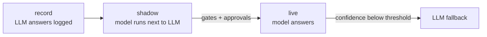

[](https://pypi.org/project/pecca/)
[](https://github.com/pecca-core/pecca/actions/workflows/ci.yml)
[](https://pecca-core.github.io/pecca)
[](LICENSE)
[](https://pypi.org/project/pecca/)

## Replace repetitive LLM calls with small, auditable models.

Pecca finds the LLM calls in your pipeline that only ever return a fixed label, trains a CPU model on your logged outputs, shadows it against the LLM, and promotes it when it passes your gates. The LLM stays as fallback.


```python
import pecca


@pecca.replace("route_email", mode="shadow")  # 1. wrap your existing LLM call
def route_email(text: str) -> str:
    return my_llm.classify(text)  #    (unchanged)


pecca.train("route_email")  # 2. trains on the logs the decorator recorded
pecca.promote("route_email", mode="live")  # 3. model answers in ~30 ms; LLM is the fallback
```

*`my_llm` is whatever you already use (OpenAI, Bedrock, Claude, local). Pecca never calls it itself; it learns from the answers it already gave.*

*`train` needs recorded logs or a configured datasource; see the [quickstart](https://pecca-core.github.io/pecca/quickstart/).*

## Install

```bash
pip install pecca            # CPU: transformers, torch, sentence-transformers, onnxruntime, scikit-learn, lightgbm
pip install 'pecca[databricks]'   # also: [snowflake] [bigquery] [mlflow] [wandb] [vault] [aws] [pdf] [gpu] [all]
```
Python 3.11, 3.12 or 3.13. On Linux, install the CPU wheel of torch to keep the install small (`--index-url https://download.pytorch.org/whl/cpu`). macOS wheels are already CPU/MPS.

## 60-second quickstart

```bash
pecca datasets demo                       # synthetic "Northbridge Bank" emails, offline
pecca init --profile none                 # pecca.yaml + templates/
pecca profile                             # which calls can be replaced?
pecca train default/default/route_rfi --candidates tfidf_linear,e5_logreg
pecca promote default/default/route_rfi --mode shadow
pecca status default/default/route_rfi    # then: pecca promote ... --mode live once the gates pass
```
Full walkthrough with real output: [Quickstart](https://pecca-core.github.io/pecca/quickstart/) · [](https://colab.research.google.com/github/pecca-core/pecca/blob/main/examples/quickstart.ipynb)

## Examples

Executed notebooks (agent frameworks, monitoring) and config-only vendor guides: [Examples](https://pecca-core.github.io/pecca/examples/).

## How it works



1. **Profile**: deterministic rules decide which calls are closed-set (classification or regression) and have enough history.
2. **Tournament**: eligible models (TF-IDF, multilingual-e5 + linear head, optional fine-tuned XLM-R, tabular models, your own) train on identical cross-validated splits; the best measured metric wins.
3. **Calibrate**: confidence is calibrated and a threshold is chosen for your target precision (default 0.95).
4. **Shadow → live**: governance gates, approvals and evidence decide promotion. Below the threshold the original LLM answers.
5. **Audit pack**: lineage, benchmarks, confusion matrix, threshold rationale, approvals and drift history for every version.

## Philosophy

- **Data decides, not prompts and not an LLM.** Task type is inferred from logged outputs by rules; the winning model is chosen by measured cross-validated metrics.
- **The user says what to replace; Pecca owns how.** You never need to know model names.
- **The LLM is never deleted, only demoted** to fallback below a calibrated confidence threshold.
- **Fit in, don't compete.** Models live in your registry (MLflow/Unity Catalog), decisions are OpenTelemetry spans, approvals go through Jira/GitHub/Slack. Pecca keeps only its own metadata.
- **Governance is primitives, not policies.** Six generic primitives; industry profiles are editable templates with no legal claim.
- **Interfaces over integrations.** Connector interfaces with a few reference implementations each; the community adds the rest.

## What Pecca is not

Not an LLM gateway, a prompt tool, an evaluation harness, a feature store or a hosted service. It does not call any LLM, has no telemetry, and does not replace free-text generation or (in v0.1) structured extraction.

## Connectors & integrations

| Kind | Reference implementations |
| --- | --- |
| Data sources | CSV, Parquet, Postgres, Databricks, Snowflake, BigQuery, OTel traces, LiteLLM logs, Databricks AI Gateway, MCP |
| Registry | local files, MLflow / Unity Catalog, Weights & Biases |
| Notifiers | Slack, Teams, webhook, MCP |
| Ticketing / approvals | Jira, GitHub Issues, manual, MCP |
| Schedulers | cron, Airflow, Databricks Workflows |
| Serving | in-process ONNX, Docker export, Databricks Model Serving |
| Secrets | environment, HashiCorp Vault, AWS Secrets Manager |
| Docs | Markdown, Confluence |
| Agent frameworks | LangGraph, Strands, Google ADK, OpenAI Agents SDK, Claude Agent SDK |
| Also | MCP server (`pecca mcp serve`), OpenTelemetry spans |

## Governance

Promotion is controlled by six generic primitives: **gates** (e.g. `agreement >= 0.90`), **approvals** (people or groups, via Jira, GitHub or manual), **evidence** (required audit-pack sections), **retention**, **schedule** (revalidation, drift review) and **controls mapping**. Everything is configured in `pecca.yaml`; `pecca promote` tells you exactly which gate, approval or evidence is missing.

> **Profiles** (`none`, `default`, `sr11-7`, `eu-ai-act`, `cbuae`, `bsp`, `rbi`, `sarb`) are templates only. They are convenience presets and **not legal or regulatory advice**. Review them with your compliance team and edit freely; Pecca enforces only what is written in your config.

## Roadmap (v1.1+)

Structured extraction; CrewAI, Pydantic AI, Microsoft Agent Framework and Mastra shims; Kafka datasource; SageMaker and Vertex registry and serving; Feast/Tecton; OPA/Rego gates; A2A; ServiceNow ticketer; hosted Cloud tier.

## Contributing

Issues and PRs are welcome. See [CONTRIBUTING.md](CONTRIBUTING.md): `uv sync`, `pre-commit`, sign off commits with `git commit -s` (DCO, no CLA). Adding a candidate, connector or profile is a good first contribution.

## Licence

Apache-2.0. Copyright 2026 Fazil Ahamed. See [LICENSE](LICENSE) and [NOTICE](NOTICE).
