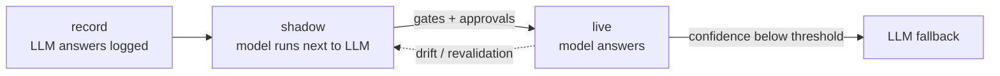

# Pecca

**Replace repetitive LLM calls with small, auditable models.**

Pecca finds the LLM calls in your pipeline that only ever return a fixed label, trains a CPU model on your logged outputs, shadows it against the LLM, and promotes it when it passes your gates. The LLM stays as fallback.


```python
import pecca


@pecca.replace("route_email", mode="shadow")  # 1. wrap your existing LLM call
def route_email(text: str) -> str:
    return my_llm.classify(text)  #    (unchanged)


pecca.train("route_email")  # 2. trains on the logs the decorator recorded
pecca.promote("route_email", mode="live")  # 3. model answers in ~30 ms; LLM is the fallback
```

*`my_llm` is whatever you already use (OpenAI, Bedrock, Claude, local). Pecca never calls it itself; it learns from the answers it already gave.*

*`train` needs recorded logs or a configured datasource; see the [quickstart](quickstart.md).*

## 30-second pitch
Many production LLM calls are classifiers in disguise: they return one of ~60 labels, run on every request and already have months of logged answers (plus human corrections). Pecca trains a small model on that history, runs it **in shadow** next to the LLM, and once it meets *your* quality and governance gates, serves those calls in milliseconds on CPU. Below a calibrated confidence it falls back to the LLM. Every model ships with an audit pack.



[Quickstart](quickstart.md){ .md-button .md-button--primary } [Examples](examples/index.md){ .md-button } [Case study](case-study/autoresponse-routing.md){ .md-button }

## Who is this for
Teams running LLM calls that return a fixed label or number, that have logged outputs (and ideally human corrections), and that need cost, latency and auditability improvements without a new platform.

## Not for
Free-text generation, open-ended extraction (not supported in v0.1), or calls with no history to learn from.
